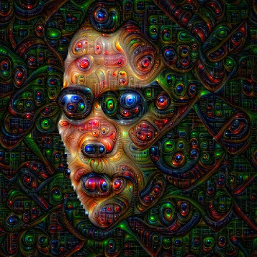
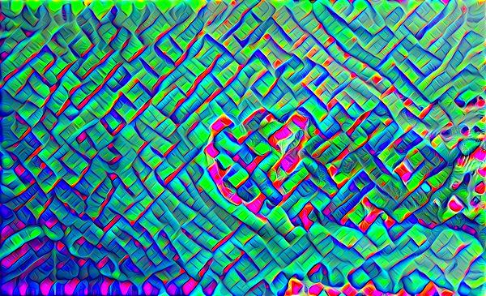

# Deep Dreaming

Implementation of deep dreaming in PyTorch.
Based on the original [blog](https://ai.googleblog.com/2015/06/inceptionism-going-deeper-into-neural.html) and [repo](https://github.com/google/deepdream) from Google Research.

Uses a VGG19 model pretrained on the ImageNet-1K dataset.

Deep CNN models are trained to recognize certain features in the training set.
Because the training set has a finite number of data and data classes
it means that when an image is sent through the network it will be
interpreted using the existing training of the model.

This can be exploited to generate some interesting looking images.

  
  
  
Input on the left, deep dreamed on the right.
 

An image sent through the network is stopped at a certain layer
corresponding to a certain level of abstraction.
The network might see some features that resembles things from the training set.
These features are then amplified in the input image using gradient ascent
with gradients computed using PyTorch autograd from the MSE loss of the features.
The results are therefore highly dependent on the dataset.

The original implementation also does some more tricks to get better image outputs:
* Add random offsets to the image at each epoch. This confuses the model and results in it seeing more features.
* Normalizing the gradients making the iterations more stable.
* Ascend at different octaves. An octave in this context refers to a scaled version of the input image.

## Feature Abstractions

It is well known that CNNs learn low-abstraction features like edges and colors at the shallow layers
and higher-abstraction features at the deeper layers consisting of combinations of the lower level features.
The final layer to stop the forward pass at will therefore determine the abstraction level of the dreams.

  

  
  
  
  
  
Stopping at layer 5, 10, 19 and 28 in the VGG19 model.

## Random noise

Randon noise is sent through the deep dreams.
The output is then center cropped and scaled back to its original size to zoom in,
before sending the output back through the deep dreams again.
This iteratve provess can be repeated multiple times to create more detailed images.

  
  
  
  
Random noise gets progressively more detailed at each iteration.
 

